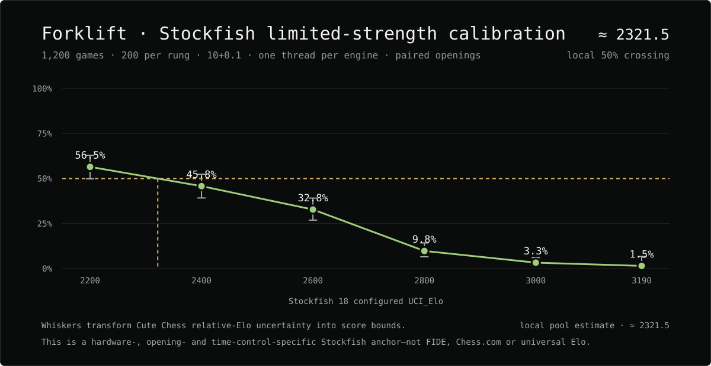
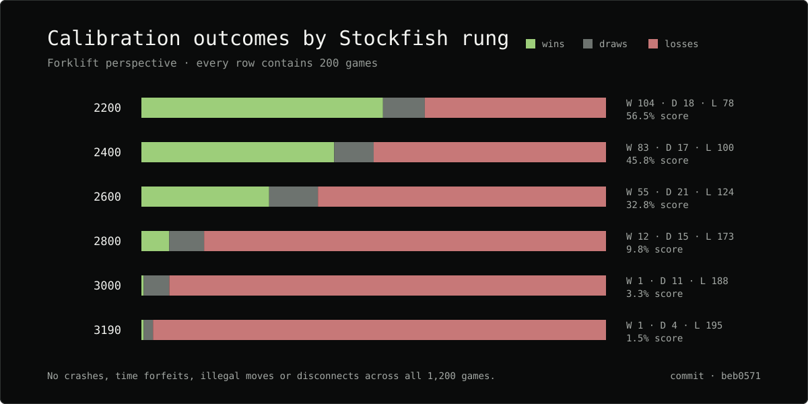

# Stockfish 18 Limited-Strength Calibration

This experiment gives Forklift a reproducible rating anchor in a named local
engine pool. It is not a FIDE, Chess.com, human, or universal engine rating.

## Contract

- Candidate: Forklift commit `beb0571c5cf740c7f14dfd779540ca7c28a5243b`
- Opponent: Stockfish 18 with `UCI_LimitStrength=true`
- Rungs: 2200, 2400, 2600, 2800, 3000, and 3190 `UCI_Elo`
- Games: 200 per rung; 1,200 total with reversed UHO openings
- Time control: `10+0.1`
- Resources: one thread and 256 MiB hash per engine; six games concurrently
- Seed: 1701
- Host: Windows 11, AMD64, 24 logical CPUs
- Runner worktree: clean at `beb0571`
- Stockfish SHA-256: `9bde420202717ce083412027fbfb8c5c935b537591d712be8a8a8bae92f6e8d6`
- Forklift SHA-256: `c14c3faeae69da6f639209498b87d8b50ec8cf48c3233ac0a5f555ec38672d64`
- Opening-suite SHA-256: `3f499996ff0b674a04f85f2634811d102dd53b5115841e8f11d18e1f550ba2ca`

The complete manifests, PGNs, logs, binaries and JSON results are retained at
`E:\Dev\Forklift-Research\matches\absolute-calibration-main-20260826`.

## Results

| Stockfish `UCI_Elo` | Forklift wins | Draws | Losses | Score | Relative Elo | Anchored point |
|---:|---:|---:|---:|---:|---:|---:|
| 2200 | 104 | 18 | 78 | 56.5% | +45.4 +/- 46.5 | 2245.4 |
| 2400 | 83 | 17 | 100 | 45.8% | -29.6 +/- 46.4 | 2370.4 |
| 2600 | 55 | 21 | 124 | 32.8% | -125.0 +/- 48.5 | 2475.0 |
| 2800 | 12 | 15 | 173 | 9.8% | -386.6 +/- 75.2 | 2413.4 |
| 3000 | 1 | 11 | 188 | 3.3% | -589.5 +/- 114.9 | 2410.5 |
| 3190 | 1 | 4 | 195 | 1.5% | -726.9 +/- 270.0 | 2463.1 |

## Interpretation

Linear interpolation between the 2200 and 2400 score observations places the
50% crossing at approximately **2321.5** in this exact Stockfish limited-strength
pool. It is reasonable to describe this result as a local estimate of roughly
**2300–2350**, while retaining the match conditions and uncertainty alongside
the number.

All 1,200 games completed with zero crashes, time forfeits, illegal moves, or
disconnects. A second campaign concentrated near the crossing and run at a
slower time control is required before narrowing the estimate or treating it as
portable across machines and playing conditions.
