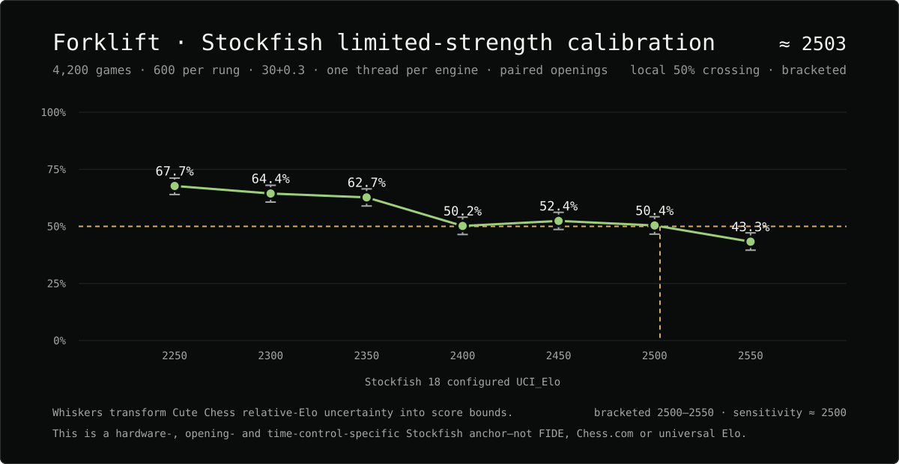
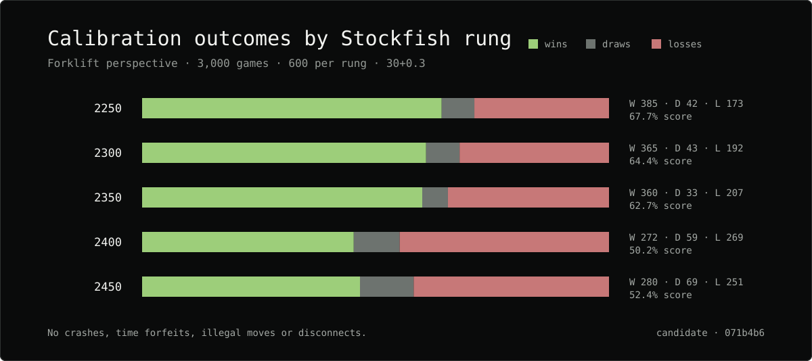

# Stockfish 2450 Calibration Extension

This experiment extends Forklift's slower Stockfish 18 limited-strength ladder
by one rung. It is a rating anchor in this exact local engine pool, not a FIDE,
Chess.com, human, or universal engine rating.

## Contract

- Candidate: Forklift commit `071b4b624629ead2326b8ff03cace89b0520aa1f`
- Opponent: Stockfish 18 with `UCI_LimitStrength=true` and `UCI_Elo=2450`
- Games: 600 with reversed UHO openings
- Time control: `30+0.3`
- Resources: one thread and 256 MiB hash per engine; six games concurrently
- Seed: 2701
- Host: Windows 11, AMD64, AMD Family 25 Model 33, 24 logical CPUs
- Start: 2026-08-27 12:20 BST
- Completion: 2026-08-27 14:39 BST; approximately 2 hours 19 minutes wall time
- Stockfish SHA-256: `9bde420202717ce083412027fbfb8c5c935b537591d712be8a8a8bae92f6e8d6`
- Forklift SHA-256: `3c0b5e1cdfa350be7aa35165f91276662e77105891e6a8984089b24f85651a11`
- Opening-suite SHA-256: `3f499996ff0b674a04f85f2634811d102dd53b5115841e8f11d18e1f550ba2ca`
- Cute Chess SHA-256: `8889f9582dc688c567704cf083f6025baf77f791cde903698c70b3420caf5d7e`

The complete manifest, 600-game PGN, logs, binaries, and JSON results are
retained at
`E:\Dev\Forklift-Research\matches\absolute-calibration-extension-2450-20260827`.

## Result

| Stockfish `UCI_Elo` | Forklift wins | Draws | Losses | Score | Relative Elo | Anchored point |
|---:|---:|---:|---:|---:|---:|---:|
| 2450 | 280 | 69 | 251 | 52.4% | +16.8 +/- 26.2 | 2466.8 |

All 600 games completed with zero crashes, time forfeits, illegal moves, or
disconnects.

## Interpretation

Forklift scored `280-69-251`, or 52.4%, against the Stockfish 2450 setting. The
direct local-pool anchor is **2466.8 +/- 26.2 Elo**, giving a simple sampling
interval of approximately 2440.6 to 2493.0.

This is compatible with both a small Forklift advantage and an approximately
level match. More importantly, the observed score remains above 50%, so the
formal ladder result is still `above_range`: a crossing cannot be interpolated
until a higher rung scores below 50%. The next controlled measurement is 600
games against Stockfish 2500 with the same candidate, openings, time control,
resources, concurrency, and seed.

Taken together with the earlier 2250-2400 campaign, this supports a conservative
description of roughly 2450-2470 under these exact conditions. It must not be
presented as a universal rating.

The subsequent [2500 extension](2026-08-28-stockfish-2500-extension.md) was
approximately level and moved the next strict-bracketing measurement to 2550.

## Evidence checksums

- `ladder-manifest.json`: `035674fe0f10539cb180ba39b79499ebc2ba2dc5cf968024294a584e965e4b32`
- `summary.json`: `200fc05c8c1a78f6ca5a3f906a3886b0127a0e414a89d0598449d7871ba9d7fb`
- `report.md`: `d7606867f5ff1e92fa92e435f72c8b69dc5062431b6a1d243456a337d2815385`
- 2450 PGN: `a8bb5cb57f80796a7cd42613557411aa4295f776939e784795345674140d5a55`
